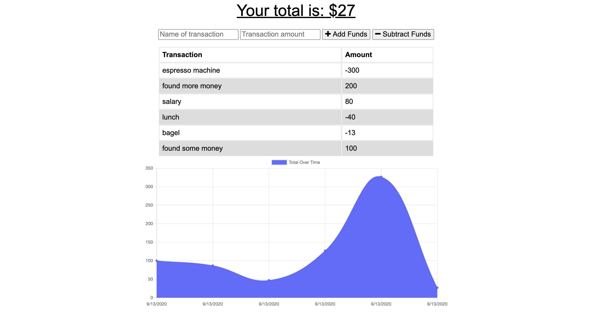

# Online-Offline-Budget-Tracker
[](https://opensource.org/licenses/MIT)

## Table of Contents
- [Description](#description)
- [Installation](#installation)
- [Usage](#usage)
- [License](#license)
- [Contributing](#contributing)
- [Questions](#questions)

## Description
A budget tracker that has offline access and functionality, giving users the ability to view their tracker and also add expenses and deposits even without a connection. When users come back online, any data they entered while offline will automatically be sent to the server, giving a seamless experience as if they were never disconnected.

## Installation
Clone or download the package and open terminal in the package directory. Then run the following command to install all the dependencies into the local node_modules folder:

```
npm i
```

## Usage
Find the deployed application [here](https://safe-dusk-75030.herokuapp.com/)!

The application will look something like this:



## License
Licensed under the MIT License.

## Contributing
To contribute directly to the code base, please see this [How to Contribute](https://github.com/Microsoft/vscode/wiki/How-to-Contribute) document.

## Questions
If you have any questions or want to have a chat about this project, contact me at yilinlee19@gmail.com or on [LinkedIn](https://www.linkedin.com/in/yi-lin-lee/) 😋
